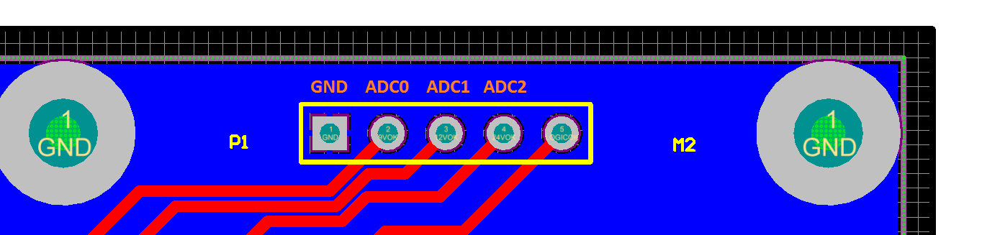

# daVinci-Boxes
da Vinci Boxes

## Board Pinout ##

| Board |  ADC0   |   ADC1  |   ADC2   |
|-------|---------|---------|----------|
|  MTM  | 12v  | 24v  |  12v  |
|  PSM  | 12v  | 24v  |  x  |
|  ECM  | 12v  | 32v  |  x  |

## Lights ##

| Pattern | Meaning |
|---------|---------|
| Flashing Red  |  No power (V < ~1v) |
| Solid Red     |  Voltage Present but too low |
| Solid Green   |  Voltage present and within ~1v of target |
| Solid Orange  |  Voltage Present but too high |

## pinout ##

